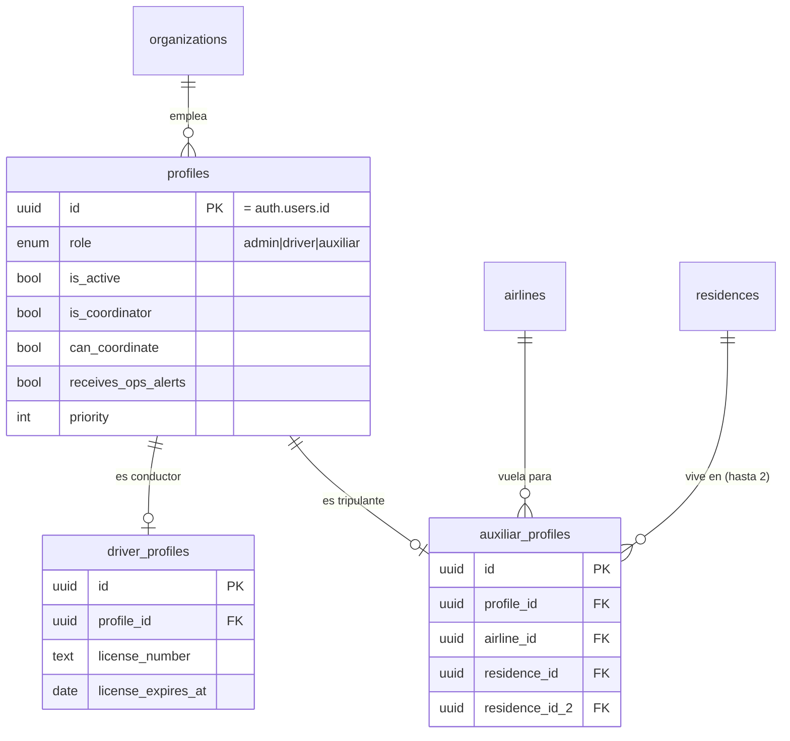
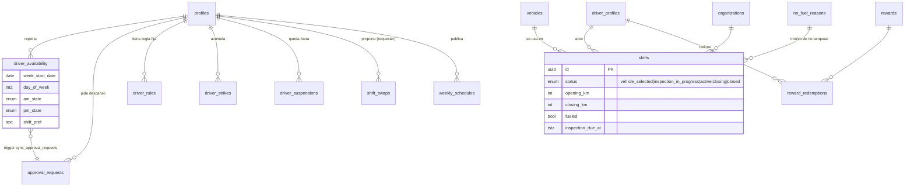
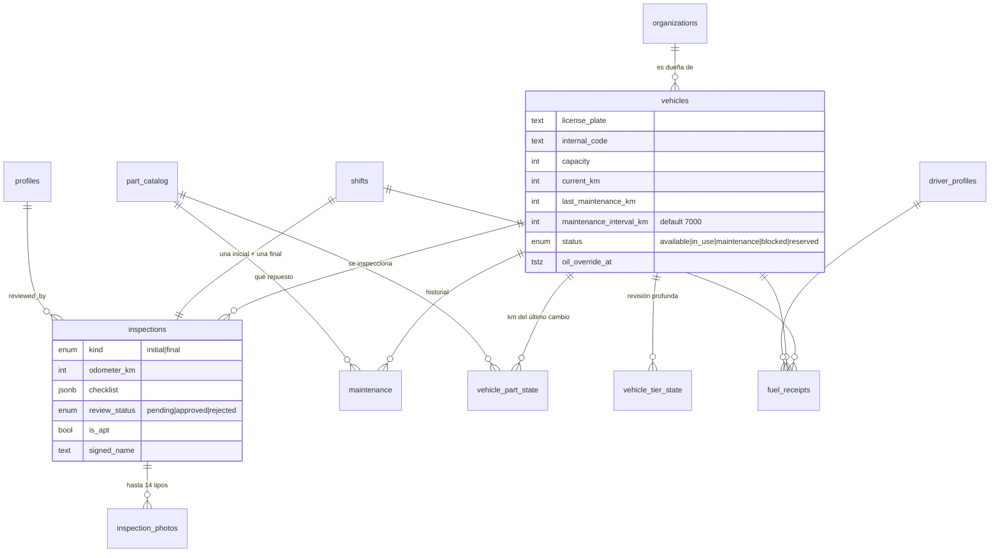
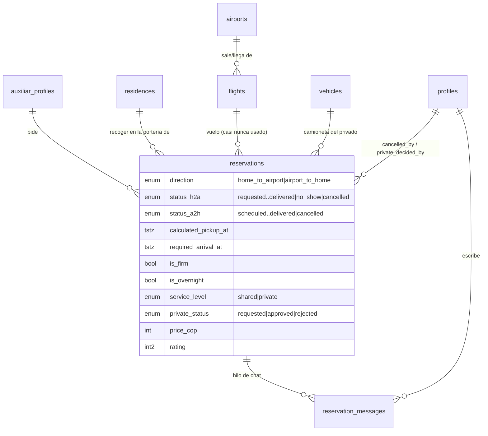
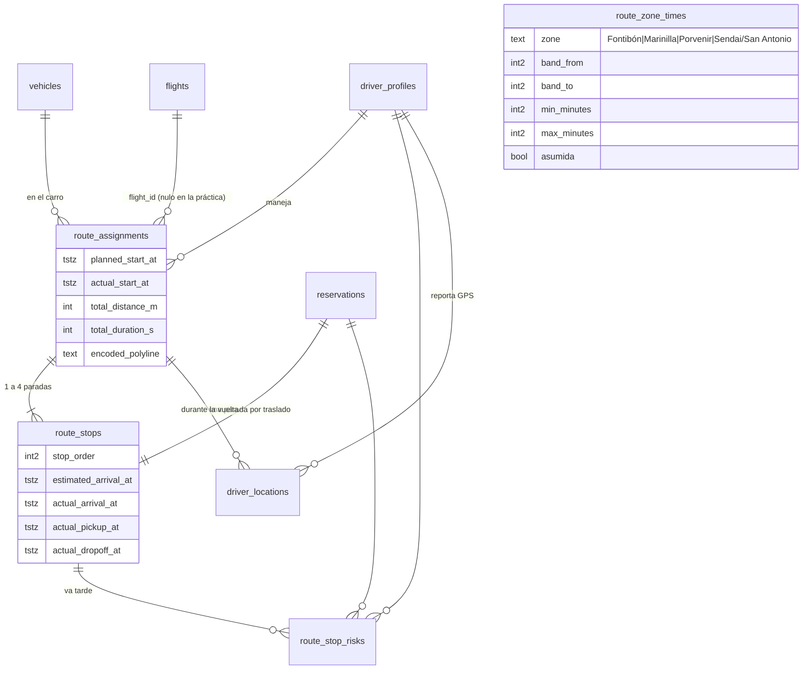
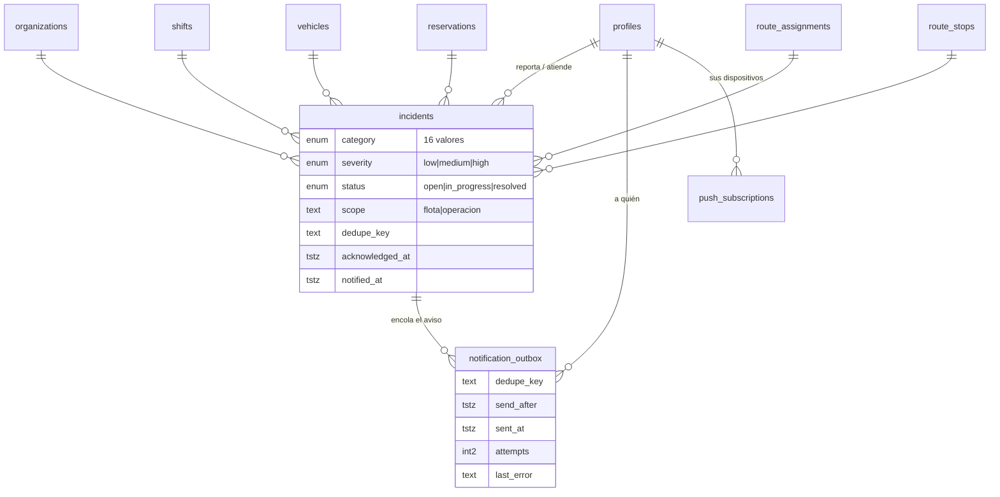

# MER — Rendio Enterprise · las dos bases

**Fecha:** 11-sep-2026 · **Fuente:** consultado en vivo contra `Rendio-dev` y `Rendio-Main` vía MCP (solo lectura).
**Alcance:** esquema `public` — 44 tablas + 3 vistas, 602 columnas, 19 enums, 139 políticas RLS, 7 jobs de pg_cron, 2 buckets de Storage.

Nada de lo que sigue viene de leer migraciones ni de memoria: cada afirmación se verificó con un `SELECT` contra `pg_catalog` o contra los datos. Donde una sospecha no aguantó la verificación, lo digo (ver §7, "lo que NO es cierto").

---

## 0. De un vistazo

| | dev | main |
|---|---|---|
| Tablas / vistas | 44 / 3 | 44 / 3 |
| Columnas | 602 | 602 (mismo md5) |
| Enums | 19 | 19 (idénticos) |
| Políticas RLS | 139 | 139 (mismo md5) |
| Índices | **170** | **169** |
| Funciones `public` | 79 | 79 |
| Jobs pg_cron | 7 | 7 (idénticos) |
| Buckets | inspections (privado, 5 MB), profiles (público, 2 MB) | igual |
| `schema_migrations` | congelada en **0039** | congelada en **0039** |

El esquema es prácticamente el mismo. **Lo que cambia de verdad es el contenido** — y eso cambia cómo se prueba (§6).

---

## 1. Los siete dominios

### 1.1 Núcleo: quién es quién (4 tablas)

| Tabla | Para qué sirve, en una línea |
|---|---|
| `organizations` | La empresa dueña de todo. Una sola fila (Rendio Enterprises); el multi-tenancy está armado pero no se usa. |
| `profiles` | La persona: nombre, rol (admin/driver/auxiliar), teléfono, si está activa, si coordina, si recibe alertas de operación. Espejo 1:1 de `auth.users`. |
| `driver_profiles` | Lo que solo le aplica al conductor: licencia, EPS, ARL y sus vencimientos. |
| `auxiliar_profiles` | Lo que solo le aplica al tripulante: aerolínea, hasta **dos** residencias con su unidad/apto, y un pin propio de casa como respaldo. |

**Tabla central: `profiles`.** Casi todo el resto apunta acá para decir "quién hizo esto". Ojo con la trampa de siempre: unas tablas apuntan a `profiles.id` (el usuario) y otras a `driver_profiles.id` / `auxiliar_profiles.id` (el sub-perfil). No son el mismo UUID.

### 1.2 Configuración y catálogos (6 tablas)

| Tabla | Para qué sirve |
|---|---|
| `app_settings` | La fila única `singleton` con los 60 parámetros que gobiernan todo. Detalle en §5. |
| `holidays` | Festivos colombianos ya trasladados al lunes (Ley Emiliani). Los domingos NO están: se detectan por fecha. 36 filas en ambas. |
| `airlines` | Aerolíneas del desplegable de registro. 4 activas: Avianca (AV), JetSMART (JA), Wingo (P5), LATAM (LA). Idéntica en las dos. |
| `airports` | Aeropuertos servidos. **1 fila en dev, 0 en main** (ver §7). |
| `residences` | Los conjuntos de Rionegro con la coordenada de la **portería** puesta a mano, porque OSM no conoce los condominios privados. 42 filas, byte a byte iguales en las dos. |
| `geocode_cache` | Caché de Nominatim para las Edge Functions. **0 filas en ambas.** |

### 1.3 Turnos y conductores — el módulo rendio-turnos (10 tablas)

| Tabla | Para qué sirve |
|---|---|
| `shifts` | El turno operativo: carro asignado, km de apertura y cierre, si tanqueó, estado. **Es el corazón del módulo.** |
| `driver_availability` | Lo que el conductor reporta para cada día de la semana, separado en AM y PM, con motivo. |
| `weekly_schedules` | El horario de la semana que arma o edita el admin. El cuadro va como JSONB en `data`, no normalizado. |
| `approval_requests` | Cada petición de descanso derivada de la disponibilidad, para que el admin la apruebe o rechace. |
| `shift_swaps` | "Cámbiame el martes AM por tu jueves PM" entre dos conductores. |
| `driver_rules` | Regla fija de un conductor: "este nunca hace domingo PM". La pone el admin. |
| `driver_strikes` | Las faltas. Tres activos disparan suspensión automática (`app_settings.strike_limit`). |
| `driver_suspensions` | La semana en que un conductor queda por fuera. La duración es implícita: una semana, porque se busca por lunes exacto. |
| `rewards` | Catálogo de premios por kilómetro (plata/oro/diamante) que define el admin. |
| `reward_redemptions` | El conductor pide su premio y el admin lo entrega. **0 filas en ambas bases.** |

**Tabla central: `shifts`** para la operación diaria, **`driver_availability`** para la planeación.
El pegamento raro: `driver_availability` tiene un trigger AFTER (`sync_approval_requests`) que **crea las filas de `approval_requests`** — no hay política INSERT para esa tabla, o sea que nadie la escribe desde el cliente.

### 1.4 Flota, inspecciones y mantenimiento (11 tablas + 3 vistas)

| Tabla | Para qué sirve |
|---|---|
| `vehicles` | La flota: placa, código interno, capacidad, odómetro, intervalo de mantenimiento, SOAT/tecnomecánica/seguro, estado. |
| `inspections` | La revisión del carro al abrir (`initial`) y al cerrar (`final`) el turno, con checklist en JSONB y aprobación del admin. |
| `inspection_photos` | Las fotos de esa inspección. 14 tipos posibles, desde `front` hasta `spare_tire` y `property_card`. |
| `inspection_checklist_items` | Qué preguntas trae el checklist. Lo edita el admin sin desplegar. 41 filas iguales en ambas. |
| `inspection_tiers` | Revisiones más profundas que tocan cada N km. 4 filas iguales en ambas. |
| `vehicle_tier_state` | Cuándo fue la última revisión profunda de cada carro. **0 en dev, 24 en main.** |
| `maintenance` | El historial de lo que se le ha hecho a cada carro, con costo, taller y duración real del repuesto. |
| `part_catalog` | Los 25 repuestos controlados, con NUESTRO intervalo en km (y meses donde aplica). Idéntico en ambas. |
| `vehicle_part_state` | Km y fecha del último cambio por carro × repuesto. **0 filas en las DOS bases** — ver §7. |
| `fuel_receipts` | La foto del tanqueo más el valor en pesos, para que el admin controle el gasto. |
| `no_fuel_reasons` | El desplegable de "por qué no tanqueé". 4 filas iguales en ambas. |

| Vista | Qué responde |
|---|---|
| `v_vehicle_maintenance_status` | Semáforo por carro: verde >500 km para el cambio, amarillo ≤500, rojo vencido. |
| `v_vehicle_part_status` | Semáforo por carro × repuesto. `light='nodata'` cuando nadie cargó el km base. **Informativo: ningún estado bloquea el carro.** |
| `v_part_real_life` | Cuánto dura de verdad cada repuesto, medido con los cambios registrados. `is_reliable` = hay 3 o más. |

**Tabla central: `vehicles`.** Todo lo de mantenimiento cuelga de ahí, y `shifts` también.

### 1.5 Traslados de la tripulación (3 tablas)

| Tabla | Para qué sirve |
|---|---|
| `reservations` | El pedido de transporte del tripulante. Direccional: `home_to_airport` o `airport_to_home`, cada uno con su propia máquina de estados. Guarda dónde recogerlo, a qué hora tiene que llegar, si pidió privado y cuánto costó. |
| `reservation_messages` | El chat de ese traslado entre tripulante, conductor y admin. `read_by` es un `uuid[]`, no una bandera. |
| `flights` | Los vuelos. **Tabla muerta** — ver §7. |

**Tabla central: `reservations`.** Tiene 33 columnas y es la pieza más cargada de la base. Dos detalles que sorprenden:

- **Dos columnas de estado, no una:** `status_h2a` (9 valores) y `status_a2h` (9 valores distintos). Cuál aplica lo dice `direction`. No hay CHECK que obligue a que la otra esté en NULL.
- **`pickup_address` / `pickup_latitude` / `pickup_longitude` se llenan solos** con un trigger BEFORE (`fill_reservation_pickup`) copiando de la residencia elegida, o del pin propio del auxiliar. Si mandas el pickup explícito, no lo pisa. El asignador sigue leyendo `pickup_*` como siempre y no sabe que hubo residencias.

### 1.6 Rutas y despacho (6 tablas)

| Tabla | Para qué sirve |
|---|---|
| `route_assignments` | La vuelta: un conductor, un carro, 1 a 4 tripulantes, con la polilínea y el tiempo total estimado. |
| `route_stops` | Las paradas ordenadas de esa vuelta, con la hora estimada y la hora real de llegada, montada y entrega. |
| `route_stop_risks` | Las paradas que el conductor ya no alcanza desde donde está. Lo escribe `detect_route_risks()` cada 5 minutos, no el cliente. |
| `route_zone_times` | La tabla de Julián (16-ago-2026): minutos desde que recoge al PRIMERO hasta MDE, por zona y franja. 4 zonas × 6 franjas = 24 filas, **iguales en las dos bases**. |
| `route_leg_times` | Su segunda regla: minutos del tramo final, de la última persona recogida al aeropuerto, por franja. 6 filas, **iguales en las dos**. |
| `driver_locations` | El chorro de GPS para el tracking en tiempo real. Retención de 7 días por pg_cron. **0 filas en ambas.** |

**Tabla central: `route_assignments`.**

Las 4 zonas de Julián son: **Fontibón, Marinilla, Porvenir, Sendai/San Antonio**. Las 6 franjas son 0-2, 2-6, 6-9, 9-12, 12-19, 19-24 h. La franja 0-2 está marcada `asumida=true` en todas: es un relleno, él nunca dio ese número.

### 1.7 Avisos y eventualidades (3 tablas)

| Tabla | Para qué sirve |
|---|---|
| `incidents` | Todo lo que se sale del plan: daño del carro, tripulante que no baja, vuelo adelantado, pedido tarde. 16 categorías, 3 severidades, 3 estados. `scope` separa `flota` de `operacion`. |
| `notification_outbox` | La cola de push pendientes. La drena `drain_notification_outbox()` **cada minuto**. |
| `push_subscriptions` | El endpoint web-push de cada dispositivo. Sin fila acá, la persona no recibe nada. |

### 1.8 Auditoría (1 tabla)

`audit_events` — bitácora inmutable de eventos críticos. `bigint` autoincremental, `payload` en JSONB. **Solo el admin lee; nadie inserta desde el cliente**: entra por `log_audit_event()` y por dos triggers (`tg_audit_reservation_created`, `tg_audit_route_assigned`).

---

## 2. Los 19 enums, con sus valores

Esto es lo que más se necesita a la hora de programar, porque un valor mal escrito revienta el INSERT con un error críptico. **Los 19 son idénticos en dev y main**, mismos valores y mismo orden.

| Enum | Valores |
|---|---|
| `user_role` | `admin` · `driver` · `auxiliar` |
| `shift_status` | `vehicle_selected` · `inspection_in_progress` · `active` · `closing` · `closed` |
| `shift_period` | `am` · `pm` |
| `availability_state` | `available` · `prefer_rest` · `unavailable` · `unset` |
| `approval_state` | `pending` · `approved` · `rejected` |
| `swap_state` | `pending` · `accepted` · `rejected` · `cancelled` |
| `vehicle_status` | `available` · `in_use` · `maintenance` · `blocked` · `reserved` |
| `inspection_kind` | `initial` · `final` |
| `inspection_review_status` | `pending` · `approved` · `rejected` |
| `inspection_photo_type` | `front` · `left` · `right` · `rear` · `dashboard` · `damage` · `extra` · `admin` · `glovebox` · `door_left` · `door_right` · `road_kit` · `property_card` · `spare_tire` |
| `trip_direction` | `home_to_airport` · `airport_to_home` |
| `service_level` | `shared` · `private` |
| `private_status` | `requested` · `approved` · `rejected` |
| `reservation_status_h2a` | `requested` · `assigned` · `ready` · `en_route` · `at_pickup` · `on_board` · `delivered` · `no_show` · `cancelled` |
| `reservation_status_a2h` | `scheduled` · `in_air` · `landed` · `disembarking` · `driver_assigned` · `picked_up` · `en_route_home` · `delivered` · `cancelled` |
| `flight_status` | `scheduled` · `boarding` · `in_air` · `delayed` · `advanced` · `landed` · `cancelled` · `diverted` |
| `incident_category` | `cant_leave_on_time` · `address_change` · `driver_late` · `flight_delay` · `flight_advanced` · `terminal_change` · `missed_flight` · `traffic` · `aux_not_responding` · `aux_not_ready` · `wrong_address` · `vehicle_problem` · `other` · `aux_emergency` · `late_booking` · `needs_third_vehicle` |
| `incident_severity` | `low` · `medium` · `high` |
| `incident_status` | `open` · `in_progress` · `resolved` |

**Trampas de los enums:**
- `reservation_status_h2a` y `reservation_status_a2h` comparten cuatro nombres (`delivered`, `cancelled`, y por poco `ready`/`scheduled`) pero son **tipos distintos**. Un cast entre ellos falla.
- `incident_category` tiene 16 valores pero en producción **solo se ha usado uno**: `vehicle_problem` (62 de 62 incidentes en main).
- `scope` de `incidents` NO es un enum, es `text` libre. Los valores vistos: `flota` y `operacion`.

---

## 3. Las relaciones que importan

97 llaves foráneas en total, idénticas en las dos bases. Las que hay que tener en la cabeza:

**Cardinalidades de la operación**
- `organizations 1 — N profiles — 0..1 driver_profiles | 0..1 auxiliar_profiles`
- `driver_profiles 1 — N shifts 1 — 2 inspections 1 — N inspection_photos`
- `auxiliar_profiles 1 — N reservations 1 — 0..1 route_stops N — 1 route_assignments`
- `route_assignments 1 — 1..4 route_stops` (el tope de 4 es por capacidad del carro, no por constraint)
- `auxiliar_profiles N — 0..2 residences` (`residence_id` y `residence_id_2`)

**Qué pasa al borrar (`ON DELETE`)** — importa más de lo que parece:
- `CASCADE` en lo que es hijo de verdad: `inspection_photos`→`inspections`, `route_stops`→`route_assignments`, `fuel_receipts`→`shifts`, `auxiliar_profiles`/`driver_profiles`→`profiles`, `profiles`→`auth.users`.
- `RESTRICT` en lo que es historia: `shifts`→`vehicles`, `shifts`→`driver_profiles`, `inspections`→`vehicles`, `maintenance`→`vehicles`, `reservations`→`auxiliar_profiles`. **No se puede borrar un carro ni un conductor que ya trabajó.** Por eso `vehicles` y `profiles` tienen `deleted_at` (borrado suave).
- `SET NULL` en todo lo que es "quién lo hizo": `*_by`, `assigned_to`, `reviewed_by`. Si se borra el admin, el registro sobrevive sin firma.

**Los dos ciclos de RLS que hubo que romper con funciones `SECURITY DEFINER`:**
- `driver_profiles ↔ route_assignments` → lo resuelve `aux_has_active_route_with_driver()`
- `reservations ↔ route_stops` → lo resuelve `driver_has_stop_for_reservation()`

Si alguna vez agregas una política que vuelva a cruzar esas dos tablas directamente, Postgres entra en recursión infinita y el error no dice dónde.

---

## 4. RLS: quién puede leer y escribir qué

**Las 44 tablas tienen RLS activado.** Las 3 vistas no (heredan de las tablas que consultan).

### 4.1 Las cuatro funciones que sostienen todo

Todas `SECURITY DEFINER`, y todas leen el JWT — al que `custom_access_token_hook` le mete `role` y `organization_id` en el momento de emitirlo:

- `current_user_role()` → `'admin'` | `'driver'` | `'auxiliar'`
- `current_user_org()` → el UUID de la organización
- `current_driver_id()` → `driver_profiles.id` del usuario actual
- `current_auxiliar_id()` → `auxiliar_profiles.id` del usuario actual

**Consecuencia práctica:** si cambias el rol de alguien en `profiles`, **no le cambia nada hasta que renueve el token**. El rol vive en el JWT, no en la consulta.

### 4.2 El patrón general

| Tipo de tabla | Quién lee | Quién escribe |
|---|---|---|
| Catálogos (`airlines`, `holidays`, `residences`, `part_catalog`, `no_fuel_reasons`, `inspection_tiers`, `route_zone_times`, `route_leg_times`) | todos los de la org | solo admin (`ALL`) |
| Lo propio (`shifts`, `driver_availability`, `fuel_receipts`, `inspections`, `push_subscriptions`) | dueño + admin | dueño |
| Lo del tripulante (`reservations`) | el dueño, el admin, y **el conductor solo si tiene una parada de ese traslado** | el dueño y el admin |
| Lo derivado (`approval_requests`, `route_stop_risks`, `vehicle_tier_state`, `audit_events`) | según el caso | **nadie desde el cliente** |

### 4.3 Las políticas que hay que conocer

**`app_settings`** — `SELECT` con `qual = true`: **cualquiera autenticado lee los 60 parámetros**, incluida la tarifa del privado. Solo el admin actualiza. Es deliberado (el cliente necesita los tiempos), pero conviene saberlo antes de meter ahí algo sensible.

**`reservations`** — la más fina de todas:
- El auxiliar solo ve las suyas (`auxiliar_profile_id = current_auxiliar_id()`).
- El conductor las ve **solo mientras tenga una parada asignada** — `driver_has_stop_for_reservation(id)`. Se le cierra la ventana cuando la parada desaparece.
- El auxiliar puede editar la suya **únicamente si faltan más de 2 horas** para `calculated_pickup_at`. Está escrito en la política, no en el código: `(calculated_pickup_at - now()) > '02:00:00'`.
- **El conductor NO tiene política de UPDATE.** Mueve el estado solo por `driver_set_reservation_status()`.

**`shifts`** — `p_shifts_update_own` deja al dueño o al admin de la misma org. Pero el cierre real va por `close_shift()` / `force_close_shift()`, que validan km y liberan el carro. Actualizar `shifts` a mano por la API salta esa lógica.

**`driver_locations`** — el tripulante puede ver el GPS del conductor **solo si hay una parada suya en esa misma `route_assignment_id`**. Es la política más elaborada de la base.

**`profiles`** — hay una política `p_profiles_auth_admin_read` con `qual = true`, que parece un hueco. **No lo es:** su `roles` es `{supabase_auth_admin}`, no `{authenticated}`. Existe para que el hook del JWT pueda leer el rol. Las otras 6 políticas sí van contra `authenticated` y sí filtran por org.

**Sin ninguna política (RLS on + 0 políticas = nadie desde el cliente):**
- `geocode_cache` — a propósito, solo Edge Functions con `service_role`.
- `notification_outbox` — a propósito, solo las funciones que encolan y drenan.

**Solo lectura, escritura exclusiva por función:**
- `audit_events` (SELECT admin) · `route_stop_risks` (SELECT) · `vehicle_tier_state` (SELECT)
- `approval_requests` tiene SELECT y UPDATE pero **no INSERT**: las filas nacen del trigger.
- `inspections` no tiene UPDATE: aprobar/rechazar es `review_inspection()`.

---

## 5. `app_settings`: los 60 parámetros, agrupados por para-qué-sirven

Ordenados alfabéticamente no sirven de nada. Así sí:

**Identidad (1)** — `id` (siempre `'singleton'`)

**Jornadas y cupos del horario (6)** — `morning_label`, `afternoon_label`, `morning_slots`, `afternoon_slots`, `coord_slots`, `shift_hours`

**Reapertura de la disponibilidad (2)** — `reopen_week_start`, `reopen_until`. Los dos NULL = nadie reabrió nada.

**Ciclo de vida del turno (6)** — `auto_close_hours` (red de seguridad), `reservation_idle_minutes` (cuándo se suelta un draft), `inspection_grace_minutes`, `fast_start_enabled`, `fast_start_from_hour`, `fast_start_to_hour`

**Disciplina (1)** — `strike_limit` (3 strikes = suspensión)

**Rutas · tiempos base y geometría (7)** — `route_airport_leg_min`, `route_default_capacity`, `route_service_min` (frenazo por portería, no por pasajero), `route_airport_buffer_min`, `route_turnaround_min`, `route_depart_cushion_min`, `route_zone_cushion_min`

**Rutas · factores de corrección de OSRM (2)** — `route_traffic_factor` (1.05; el 1.25 anterior inflaba el día 29 %), `route_airport_factor` (0.80, porque OSRM sobreestima ese corredor). **Ninguno aplica cuando los tiempos vienen de TomTom.**

**Rutas · desembarque por aerolínea (6)** — `route_deplane_min` (respaldo cuando no se puede clasificar el vuelo), `route_deplane_av_nac_min`, `route_deplane_av_int_min`, `route_deplane_js_nac_min`, `route_deplane_js_int_min`, `route_deplane_wingo_min`. LATAM está en el catálogo pero **no tiene columna propia**: cae al respaldo.

**Rutas · cómo arma el solver las vueltas (9)** — `route_merge_window_min`, `route_cars_count`, `route_car_priority`, `route_rescue_early`, `route_rescue_max_early_min`, `route_max_early_min`, `route_sweep_tol_min`, `route_sweep_slack_pct`, `route_holiday_shift_min`

**Rutas · techo de espera del pasajero (2)** — `route_max_wait_min`, `route_max_wait_peak_min`. **Los dos en 0 = sin techo**, aunque el comentario diga que el jefe usa 50 y 60.

**Rutas · semáforo de riesgo (5)** — `route_margin_tight_min`, `route_risk_threshold_min`, `route_risk_speed_kmh`, `route_risk_stale_min`, `route_risk_incident_min`

**Hotel de pernocta (3)** — `route_hotel_name`, `route_hotel_lat`, `route_hotel_lng`. Con lat/lng en NULL el solver trata la parada como aeropuerto.

**Trato con el tripulante (3)** — `aux_wait_minutes`, `aux_min_lead_hours`, `aux_noshow_alert_min`

**Traslado privado (4)** — `aux_private_enabled`, `aux_private_price_cop`, `aux_private_vehicle_id`, `aux_private_block_min`

**Metadatos (3)** — `updated_by`, `created_at`, `updated_at`

---

## 6. dev vs main — lo que de verdad hay que mirar antes de subir

### 6.1 Esquema: casi idéntico

Verificado con md5 sobre los catálogos:

| Qué | dev | main | ¿Igual? |
|---|---|---|---|
| 602 columnas (nombre + tipo + NOT NULL + default) | `ff7290ff…` | `ff7290ff…` | ✅ idéntico |
| 19 enums con sus valores y orden | — | — | ✅ idéntico |
| 139 políticas RLS (tabla, nombre, cmd, roles, qual, with_check) | `3f0a3f00…` | `3f0a3f00…` | ✅ idéntico |
| 79 funciones (nombre + firma) | — | — | ✅ idéntico |
| 7 jobs de pg_cron | — | — | ✅ idéntico |
| 2 buckets de Storage | — | — | ✅ idéntico |
| **170 / 169 índices** | `8d5a320e…` | `f11bc5cf…` | ❌ **uno de más en dev** |

**Las 3 diferencias de esquema, todas cosméticas:**

1. **Índice duplicado en `residences` (solo dev).** Hay `idx_residences_org_name` **y** `idx_residences_org_name_ci`, con definición byte a byte igual: `UNIQUE (organization_id, lower(btrim(name)))`. Main solo tiene el `_ci`. No cambia el comportamiento, solo cuesta una escritura extra por INSERT. Y mientras estamos ahí: `residences` termina con **tres** índices únicos sobre el nombre — los dos anteriores más `residences_org_name_key UNIQUE (organization_id, name)`, que es sobre el nombre crudo. Dos de los tres sobran.

2. **Orden de 3 columnas de `app_settings`.** Los nombres, tipos y defaults son idénticos; solo rotó la posición física:

   | posición | dev | main |
   |---|---|---|
   | 46 | `route_risk_incident_min` | `route_holiday_shift_min` |
   | 47 | `aux_noshow_alert_min` | `route_risk_incident_min` |
   | 48 | `route_holiday_shift_min` | `aux_noshow_alert_min` |

   Invisible para cualquier consulta con columnas nombradas. Rompe `SELECT *` posicional y `INSERT` sin lista de columnas. El código no hace ninguna de las dos, así que hoy no duele.

3. **Comentario de `shifts_close_block_vehicle()`.** dev dice *"Desde 0069 ya NO bloquea el vehículo…"*, main dice *"Desde 0073…"*. El cuerpo de la función es el mismo. Es un rastro de que la misma corrección se aplicó dos veces con nombres distintos.

### 6.2 Datos: acá está la diferencia real

Esto es lo que cambia cómo se prueba algo. Las dos bases están **especializadas en lados opuestos del producto**.

| Tabla | dev | main | Qué significa |
|---|---|---|---|
| `profiles` | **121** (3 admin, 12 driver, 106 aux) | **20** (2 admin, 17 driver, 1 aux) | dev es la base de tripulantes; main es la de conductores |
| `auxiliar_profiles` | **106** | **1** | el módulo de tripulantes **no está probado en producción** |
| `driver_profiles` | 12 | 17 | |
| `reservations` | **151** | **1** | idem — 151 traslados en dev, uno solo en main |
| `route_assignments` | **14** | **0** | **el asignador de rutas nunca ha corrido en producción** |
| `route_stops` | 40 | 0 | |
| `reservation_messages` | 7 | 0 | el chat tampoco |
| `shifts` | 18 | **289** | main es donde vive la operación diaria de turnos |
| `inspections` | 16 | **477** | |
| `inspection_photos` | 59 | **1894** | ~2 GB de fotos que dev no tiene |
| `fuel_receipts` | 6 | **235** | |
| `driver_availability` | **9** | **661** | dev no sirve para probar el horario |
| `approval_requests` | **0** | **693** | idem |
| `weekly_schedules` | 4 | 14 | |
| `driver_rules` | 6 | **79** | |
| `driver_strikes` | 5 | **50** | |
| `driver_suspensions` | **0** | 11 | |
| `incidents` | 9 (5 flota + 4 late_booking) | **62** (62 flota, 0 de operación) | |
| `vehicles` | **3** | **8** | |
| `vehicle_tier_state` | 0 | 24 | |
| `maintenance` | 2 | 16 | |
| `audit_events` | 787 | 594 | |
| `notification_outbox` | **12 atascados** | 0 | ver §7 |
| `airports` | 1 | **0** | ver §7 |
| `flights` | 6 (todos de jul-ago) | **0** | ver §7 |
| `push_subscriptions` | 3 | 11 | |
| **Cero en las DOS** | `driver_locations`, `geocode_cache`, `reward_redemptions`, `route_stop_risks`, `vehicle_part_state`, `shift_swaps`(1 en main) | | ver §7 |

**Los catálogos sí están sincronizados** (verificado con md5 del contenido, no de los ids):
`residences` (42, mismos nombres y coordenadas), `holidays` (36), `airlines` (4), `part_catalog` (25), `inspection_checklist_items` (41), `inspection_tiers` (4), `no_fuel_reasons` (4), `route_zone_times` (24) y `route_leg_times` (6).

### 6.3 La `app_settings` NO está sincronizada

**Esto es lo más peligroso de la lista y no se ve en ningún diff de esquema.** La fila `singleton` tiene valores distintos en 9 parámetros, y varios cambian directamente lo que calcula el solver de rutas:

| Parámetro | dev | main | Qué implica la diferencia |
|---|---|---|---|
| `auto_close_hours` | 14 | **23** | en main un turno colgado tarda casi un día en cerrarse solo |
| `route_cars_count` | **3** | 2 | dev planea con 3 carros, main con 2 → **planes distintos con los mismos datos** |
| `fast_start_to_hour` | 22 | 17 | ventana de arranque rápido mucho más ancha en dev |
| `route_merge_window_min` | 20 | 15 | dev fusiona racimos más agresivamente |
| `route_deplane_av_nac_min` | 18 | 15 | |
| `route_deplane_av_int_min` | 25 | 20 | |
| `route_deplane_js_nac_min` | 28 | 25 | |
| `route_deplane_js_int_min` | 33 | 30 | dev asume 3-5 min más de desembarque en las 4 |
| `reopen_week_start` / `reopen_until` | NULL | **2026-06-29 / 2026-06-29T03:17Z** | main quedó con una reapertura de junio sin limpiar (ya vencida, inofensiva, pero sucia) |

Si pruebas el tablero de rutas en dev y lo comparas contra lo que hace main, **van a dar planes distintos aunque el código sea el mismo**. La causa es esta tabla, no el código.

---

## 7. Las trampas

### 7.1 No hay fuente de verdad del SQL

`supabase_migrations.schema_migrations` está **congelada en 0039 en las dos bases**. Mientras tanto:
- El código en `rendio-turnos/*.js` cita migraciones hasta la **0079** en sus comentarios.
- En el repo hay **un solo archivo** `.sql`: `C:\Users\hepena\Documents\Proyectos\Rendio\Rendio-Enterprise\db\migraciones\0077-strikes-mensuales.sql`.
- Ese archivo **todavía no se ha aplicado**: `driver_strikes` no tiene la columna de mes en ninguna de las dos bases (sus 10 columnas son `id, profile_id, reason, week_start_date, created_by, voided_at, voided_by, consumed_at, created_at, updated_at`).

O sea: de la 0040 a la 0079 **el SQL se aplicó a mano y no quedó registrado en ninguna parte**. No se puede reconstruir ninguna de las dos bases desde cero, no se puede saber qué se aplicó a cuál, y la única razón por la que hoy coinciden es que alguien corrió lo mismo dos veces con cuidado. La prueba de que ese cuidado ya falló una vez es el índice duplicado en `residences` y el comentario que dice 0069 en una base y 0073 en la otra.

**Corolario para el que vaya a subir algo:** el orden que dice el propio 0077 —*"correr primero en Rendio-dev, verificar, y después en Rendio-Main"*— es la única disciplina que existe. No hay nada que la haga cumplir.

### 7.2 `flights` y `airports` están muertas

- `flights` tiene **0 filas en main** y 6 en dev, todas creadas entre el 14-jul y el 1-ago-2026.
- `flights.airport_id` es **NOT NULL** y apunta a `airports`, que tiene **0 filas en main**. Es decir: **en producción es literalmente imposible insertar un vuelo**. La FK no tiene a quién apuntar.
- La app **no lee ni escribe ninguna de las dos**: no existe un solo `from('flights')` ni `from('airports')` en todo el JS.
- La única mención de `flight_id` en el código es en `rendio-turnos/api.js:2199`, y es para ponerlo en **`null`** al crear la reserva.
- Lo que sí se usa es `flight_number` como **texto libre** dentro de `reservations` (9 usos en `api.js`), y de ahí sale el prefijo AV/JA/P5 para escoger el tiempo de desembarque.
- Aun así, `flights` tiene 6 índices, un trigger de `updated_at`, 4 políticas RLS y un enum propio (`flight_status`, 8 valores) que nadie escribe nunca.

**Conclusión:** `flights` y `airports` son andamiaje del MVP que quedó parado. Parecen vivas en el MER por la cantidad de FKs que salen de ellas (`reservations.flight_id`, `route_assignments.flight_id`), pero esas FKs están en NULL en el 100 % de main y en el 96 % de dev (145 de 151).

### 7.3 El semáforo de repuestos no tiene con qué encenderse

`vehicle_part_state` tiene **0 filas en las dos bases**. La vista `v_vehicle_part_status` devuelve en main **175 filas, todas con `light = 'nodata'`**. Es decir: la pantalla de Repuestos está funcionando perfectamente y no le dice nada a nadie, porque el jefe nunca cargó el km del último cambio con `set_vehicle_part_baseline()`.

No es un bug — el comentario de la vista lo dice: *`light=nodata` cuando el jefe aún no cargó el km*. Pero sí es una funcionalidad completa (tabla + vista + 2 RPCs + `v_part_real_life`) que lleva meses sin producir un solo dato. Y `v_part_real_life`, que mide la duración real de cada repuesto, necesita 3 cambios registrados para marcar `is_reliable`: con 2 filas en `maintenance` en dev y 16 en main, no va a ser confiable en mucho tiempo.

### 7.4 El GPS nunca se ha prendido

`driver_locations` tiene **0 filas en las dos bases**. Y sin embargo:
- `detect_route_risks()` corre **cada 5 minutos** en ambas, buscando conductores atrasados a partir de su posición.
- `purge_old_driver_locations()` corre **todos los días a las 3:30 a.m.** para borrar datos que no existen.
- `route_stop_risks` tiene 0 filas en ambas — es la consecuencia directa.
- La política más elaborada de toda la base (la del tripulante que puede ver el GPS de su conductor) nunca ha filtrado una sola fila.
- `app_settings.route_risk_stale_min` (15 min) existe para no juzgar una ruta con un punto viejo. Con cero puntos, **toda ruta es "stale" y ningún riesgo se detecta jamás**.

Todo el módulo de tracking y riesgo está desplegado y esperando el primer `INSERT`.

### 7.5 La cola de push está atascada en dev

`notification_outbox` en dev: **12 filas, las 12 sin enviar, con 5 intentos cada una**, la más vieja del 17-ago-2026. El último error dice: `"sin dispositivo: no ha activado notificaciones"`.

No es que el despacho esté caído — `drain_notification_outbox()` corre cada minuto y sí las está intentando. Es que **los destinatarios no tienen `push_subscriptions`**. La propia función `ops_alert_health()` distingue esos dos casos a propósito (*"`atascados` = el despacho está caído (técnico); `sin_dispositivo` = los jefes no han activado notificaciones (presencial)"*). Este es el segundo caso: hay que ir a pedirle a la persona que le dé "Permitir" en el celular.

Y de paso: **el comentario de la tabla está vencido.** Dice *"SIN CONSUMIDOR hasta la 0064: en el bloque A el push lo manda el cliente que reporta. No escribir aquí todavía."* — pero el job `drain-notification-outbox` existe y corre cada minuto en las dos bases. Ese comentario le va a hacer perder media hora al próximo que lo lea.

### 7.6 La operación en producción solo ha usado una de las 16 categorías de incidente

Los 62 incidentes de main son **todos** `scope='flota'` / `category='vehicle_problem'` — la novedad que el conductor reporta al cerrar el turno. **Cero incidentes de `scope='operacion'`.** Ninguna eventualidad de ruta, ningún `late_booking`, ningún `aux_not_ready` ha llegado nunca a producción.

Es coherente con 7.4 y con `route_assignments = 0`: en main nunca ha corrido una ruta, así que las funciones `detect_ops_events()` y `detect_late_bookings()` (cada 5 minutos) no tienen nada que detectar. En dev sí aparecen 4 `late_booking`, o sea que el mecanismo funciona — simplemente no se ha estrenado.

### 7.7 Otras cosas que conviene saber

- **El rol vive en el JWT, no en la tabla.** Cambiar `profiles.role` no surte efecto hasta que la persona renueve el token (`custom_access_token_hook`).
- **`reservations` tiene dos columnas de estado y nada obliga a que la otra sea NULL.** `status_h2a` y `status_a2h` son tipos distintos; cuál vale lo decide `direction`.
- **`weekly_schedules.data` es JSONB sin esquema.** El horario de la semana no está normalizado: si cambia la forma de ese JSON, las 14 filas viejas de main quedan con la forma anterior y nadie va a avisar.
- **`reservation_messages.read_by` es `uuid[]`**, no un booleano. Hay también un `read_at` que quedó de antes; los dos conviven.
- **No se puede borrar un carro ni un conductor que ya trabajó** (`RESTRICT` desde `shifts`, `inspections`, `maintenance`). Para eso están `vehicles.deleted_at` y `profiles.deleted_at`. Cualquier pantalla que liste flota o personal tiene que filtrar por `deleted_at IS NULL` — y `v_vehicle_maintenance_status` **expone `deleted_at` pero no lo filtra**, así que el filtro es responsabilidad de quien consulte la vista.
- **`route_zone_times` tiene la franja 0-2 h marcada `asumida=true` en las 4 zonas.** Julián nunca dio ese número; es un relleno. Cualquier vuelo de madrugada se planea con un dato inventado.
- **LATAM está en `airlines` pero no tiene columna de desembarque propia** en `app_settings`. Cae al respaldo `route_deplane_min` (20 min), igual que un vuelo sin número.
- **`route_max_wait_min` y `route_max_wait_peak_min` están los dos en 0** en ambas bases = sin techo de espera, aunque el comentario diga que la programación manual usa 50 y 60.
- **`app_settings` la lee cualquier autenticado** (`qual = true`), incluida `aux_private_price_cop`.
- **`main` sigue con la reapertura de disponibilidad del 29-jun-2026** en `reopen_week_start`/`reopen_until`. Ya venció, así que no hace nada, pero si alguien consulta "¿hay reapertura activa?" sin comparar contra `now()`, va a leer basura.

---

## 8. Qué haría yo con esto

Por orden de lo que más duele:

1. **Sincronizar la fila de `app_settings`** o dejar por escrito por qué difiere. Hoy dev y main producen planes de ruta distintos con el mismo código, y no hay nada que lo advierta.
2. **Recuperar la trazabilidad del SQL.** Aunque sea un `db/migraciones/` con lo que se aplicó de la 0040 en adelante, reconstruido desde `pg_get_functiondef` y `pg_dump --schema-only`. Hoy no hay forma de levantar una tercera base.
3. **Borrar `idx_residences_org_name` en dev** (duplicado exacto) y decidir si `residences_org_name_key` sobra. Es el único drift de esquema real.
4. **Cargar el baseline de repuestos** con `set_vehicle_part_baseline()` o aceptar que esa pantalla no sirve.
5. **Actualizar el comentario de `notification_outbox`**: dice que no tiene consumidor y sí lo tiene.
6. **Decidir qué hacer con `flights` / `airports`.** O se llenan (empezando por MDE, sin el cual no se puede insertar un vuelo) o se marcan como muertas para que nadie construya encima.

---

## Diferencias entre Rendio-dev y Rendio-Main

### residences:idx_residences_org_name (solo dev)
dev tiene 170 indices y main 169. El de mas es idx_residences_org_name, definicion byte a byte identica a idx_residences_org_name_ci: CREATE UNIQUE INDEX ... USING btree (organization_id, lower(btrim(name))). Main solo tiene el _ci.

> Unico drift de esquema real entre las dos bases. No cambia comportamiento (los dos indices imponen la misma restriccion), solo cuesta una escritura extra por INSERT en residences. Rastro de que la misma migracion se aplico dos veces a mano con nombres distintos. Bonus: residences termina con TRES indices unicos sobre el nombre, contando residences_org_name_key sobre el nombre crudo.

### app_settings: posiciones 46, 47 y 48
Mismo nombre, tipo y default en las 60 columnas, pero rotaron tres posiciones. dev: 46=route_risk_incident_min, 47=aux_noshow_alert_min, 48=route_holiday_shift_min. main: 46=route_holiday_shift_min, 47=route_risk_incident_min, 48=aux_noshow_alert_min.

> Invisible para cualquier consulta con columnas nombradas; rompe SELECT * posicional e INSERT sin lista de columnas. El codigo no hace ninguna de las dos, asi que hoy no duele. Se verifico que las posiciones 1-45 y 49-60 son identicas y que el md5 de las 602 columnas (nombre+tipo+notnull+default) coincide: ff7290ff1c27062dd11bd1290049c824 en ambas.

### funcion shifts_close_block_vehicle() — comentario
dev dice 'Desde 0069 ya NO bloquea el vehiculo por mantenimiento'; main dice 'Desde 0073'. El resto del comentario y la firma son identicos.

> Confirma que la misma correccion se aplico a las dos bases en momentos distintos y con numeros de migracion distintos. Es la evidencia mas limpia de que no hay una fuente de verdad del SQL.

### app_settings: la fila singleton (9 parametros)
auto_close_hours 14/23 (dev/main), route_cars_count 3/2, fast_start_to_hour 22/17, route_merge_window_min 20/15, route_deplane_av_nac_min 18/15, route_deplane_av_int_min 25/20, route_deplane_js_nac_min 28/25, route_deplane_js_int_min 33/30, y main conserva reopen_week_start=2026-06-29 / reopen_until=2026-06-29T03:17Z mientras dev los tiene en NULL.

> ES LA DIFERENCIA MAS PELIGROSA Y NO APARECE EN NINGUN DIFF DE ESQUEMA. Con route_cars_count 3 vs 2 y route_merge_window_min 20 vs 15, el tablero de rutas produce PLANES DISTINTOS en dev y en main con el mismo codigo y los mismos datos. Quien pruebe en dev y compare contra main va a buscar el bug en el codigo y no esta ahi.

### Volumen de datos: profiles / auxiliar_profiles / reservations
profiles 121 en dev (3 admin, 12 driver, 106 aux) vs 20 en main (2 admin, 17 driver, 1 aux). auxiliar_profiles 106 vs 1. reservations 151 vs 1. reservation_messages 7 vs 0.

> Las dos bases estan especializadas en lados opuestos del producto. El modulo de tripulantes y traslados NO esta probado en produccion: hay un solo tripulante y una sola reserva en main. Para probar cualquier cosa de auxiliares hay que usar dev.

### Volumen de datos: route_assignments / route_stops / driver_locations
route_assignments 14 en dev vs 0 en main. route_stops 40 vs 0. driver_locations 0 en AMBAS. route_stop_risks 0 en ambas.

> El asignador de rutas nunca ha corrido en produccion, y el GPS nunca se ha prendido en ninguna de las dos. Aun asi detect_route_risks() corre cada 5 min y purge_old_driver_locations() cada dia a las 3:30 a.m., los dos sobre cero filas.

### Volumen de datos: shifts / inspections / inspection_photos / driver_availability / approval_requests
shifts 18 en dev vs 289 en main. inspections 16 vs 477. inspection_photos 59 vs 1894. fuel_receipts 6 vs 235. driver_availability 9 vs 661. approval_requests 0 vs 693. driver_rules 6 vs 79. driver_strikes 5 vs 50. driver_suspensions 0 vs 11. vehicles 3 vs 8.

> El lado espejo del anterior: la operacion real de turnos vive en main. dev NO sirve para probar el horario, la disponibilidad ni las aprobaciones (0 y 9 filas contra 693 y 661). Y main tiene ~1900 fotos de inspeccion que dev no tiene, asi que cualquier prueba de rendimiento de esa pantalla en dev es enganosa.

### flights / airports
airports: 1 fila en dev, 0 en main. flights: 6 filas en dev (creadas entre 14-jul y 1-ago-2026), 0 en main. flights.airport_id es NOT NULL con FK RESTRICT a airports.

> En main es LITERALMENTE IMPOSIBLE insertar un vuelo: la FK no tiene a quien apuntar. Y la app nunca las toca: no existe un solo from('flights') ni from('airports') en el JS; la unica mencion de flight_id es rendio-turnos/api.js:2199 poniendolo en null. Lo que se usa es flight_number como texto libre dentro de reservations. Son andamiaje muerto con 6 indices, 4 politicas RLS y un enum propio.

### vehicle_part_state / v_vehicle_part_status
vehicle_part_state: 0 filas en LAS DOS bases. v_vehicle_part_status devuelve en main 175 filas, TODAS con light='nodata'.

> La pantalla de Repuestos funciona perfectamente y no le dice nada a nadie, porque nadie ha corrido set_vehicle_part_baseline(). No es un bug (la vista lo documenta), pero es una funcionalidad completa —tabla + vista + 2 RPCs + v_part_real_life— sin un solo dato desde que se desplego.

### notification_outbox
dev: 12 filas, las 12 sin enviar, 5 intentos cada una, la mas vieja del 17-ago-2026, last_error = 'sin dispositivo: no ha activado notificaciones'. main: 0 filas.

> El despacho NO esta caido (drain_notification_outbox corre cada minuto en ambas y si las intenta): los destinatarios no tienen push_subscriptions. Es el caso 'presencial' que ops_alert_health() distingue a proposito. Ademas el comentario de la tabla esta vencido: dice 'SIN CONSUMIDOR hasta la 0064 ... No escribir aqui todavia' cuando el job existe y corre en las dos bases.

### incidents.scope / category
main: los 62 incidentes son scope='flota' / category='vehicle_problem'. Cero de scope='operacion'. dev: 5 flota/vehicle_problem + 4 operacion/late_booking.

> De las 16 categorias del enum incident_category, produccion solo ha usado UNA. Coherente con route_assignments=0: sin rutas no hay eventualidades de operacion que detectar. El mecanismo si funciona (dev lo demuestra con 4 late_booking), simplemente no se ha estrenado.

### supabase_migrations.schema_migrations (ambas bases)
Congelada en 0039 en dev Y en main. El codigo en rendio-turnos/*.js cita migraciones hasta 0079. El repo tiene un solo .sql: db/migraciones/0077-strikes-mensuales.sql, y esa migracion NO esta aplicada (driver_strikes no tiene columna de mes en ninguna base; sus 10 columnas son id, profile_id, reason, week_start_date, created_by, voided_at, voided_by, consumed_at, created_at, updated_at).

> De la 0040 a la 0079 el SQL se aplico a mano sin registro. No se puede reconstruir ninguna base desde cero ni saber que se aplico a cual. La unica razon por la que hoy coinciden es cuidado manual — y la prueba de que ese cuidado ya fallo son los dos puntos anteriores (indice duplicado y comentario 0069 vs 0073).

### Lo que NO difiere (verificado, para descartar sospechas)
602 columnas con md5 identico (ff7290ff1c27062dd11bd1290049c824). 19 enums identicos en valores y orden. 139 politicas RLS con md5 identico (3f0a3f00de10eecdb1ae318a6779ea15). 79 funciones con misma firma. 7 jobs de pg_cron identicos. 2 buckets identicos. Catalogos sincronizados por contenido: residences (42, mismos nombres y coordenadas), holidays (36), airlines (4), part_catalog (25), inspection_checklist_items (41), inspection_tiers (4), no_fuel_reasons (4), route_zone_times (24) y route_leg_times (6).

> route_zone_times y route_leg_times dieron md5 distinto en un primer intento, pero era artefacto de haber incluido id/created_at/updated_at en el hash. Comparando los valores de negocio fila por fila (zone, band_from, band_to, min_minutes, max_minutes, asumida) son IDENTICAS. Lo aclaro para que nadie salga a arreglar un drift que no existe.

---

## Trampas y cosas que no se pudieron verificar

- Este documento no lo escribi en ningun archivo porque la tarea decia 'ARCHIVOS TUYOS: NINGUNO'. Si lo quieres como archivo consultable, el sitio natural seria C:\Users\hepena\Documents\Proyectos\Rendio\Rendio-Enterprise\db\MER.md — junto a db/migraciones/, que es el otro lugar donde vive la verdad del esquema. Tambien puedo publicarlo como Artifact con los diagramas Mermaid ya renderizados, que para un MER se lee mucho mejor. Dime cual prefieres.
- La diferencia de app_settings (9 parametros, sobre todo route_cars_count 3 vs 2 y route_merge_window_min 20 vs 15) la reporte como problema, pero puede ser deliberada: dev con 3 carros y ventana mas ancha parece un entorno para forzar escenarios que en produccion no se dan. Si es a proposito, vale la pena dejarlo escrito en el comentario de esas columnas; si no, alguien va a perder una tarde buscando en el codigo un bug que esta en la tabla.
- No revise el cuerpo de las 79 funciones, solo nombre, firma, SECURITY DEFINER y comentario. La comparacion dev-vs-main de funciones es por firma, no por codigo: si alguna tiene el cuerpo distinto entre bases, no lo detecte. Con pg_get_functiondef() se puede hacer el md5 completo — dime si quieres que lo corra.
- El comentario de notification_outbox ('SIN CONSUMIDOR hasta la 0064 ... No escribir aqui todavia') esta claramente vencido: el job drain-notification-outbox corre cada minuto en las dos bases. Actualizarlo es un COMMENT ON TABLE de una linea, pero como la tarea dice NO ejecutar SQL no lo toque.
- No revise el esquema auth ni las Edge Functions. Si alguna Edge Function escribe en geocode_cache o en flights (las dos con cero filas), mi conclusion de 'tabla muerta' seria incompleta: solo verifique que el JS del PWA no las toca.
- supabase_migrations.schema_migrations congelada en 0039 es el hallazgo mas grave y el unico que no puedo arreglar leyendo. Reconstruir el historial de la 0040 a la 0079 requiere pg_dump --schema-only de una de las dos bases y volverlo migraciones — es un trabajo aparte, pero sin el no hay forma de levantar un tercer entorno ni de auditar que se aplico a cual.